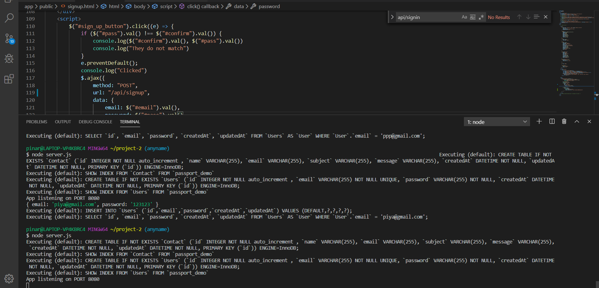
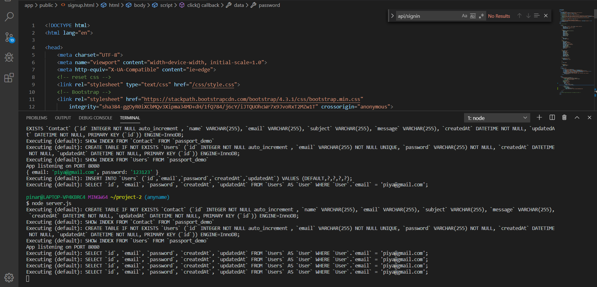
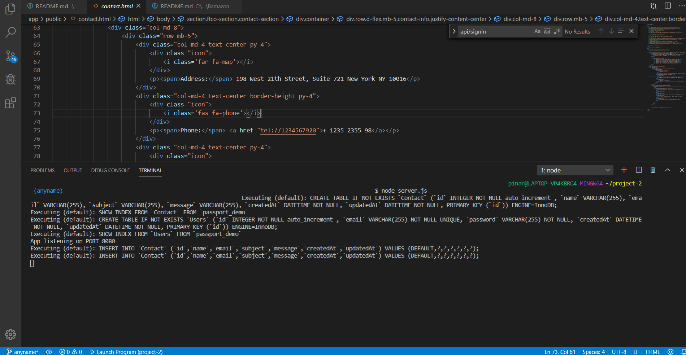

# project-2 HostTrans

This app will promote equal access to transportation for people with disabilities promoting improved accessibility for special cars.

## Overview

HostTrans App is a transportation service utilizing Node, Express, Password and the Sequelize ORM. Following the MVC design pattern, Node and Sequelize will route data from JavaScript and HTML.
HostTrans is a hospital transportation app that lets users input their needs, origin address and destination. The google map will show the route, miles and time for the drive.
Whenever a user submits a contact information, the app will send customer information and comment to MySQL.

## Technologies

This app requires a number of programs:
*   Node.js
*  MySQL Workbench
*   NPM Packages: 
*  Express
*   Body-Parser
*   MySQl
*  dotenv
*   Sequelize
*  Sequelize-CLI

## Deployment

This application is delployed at 

## Author

*   Rubival Santos
*   Pinar Kaya
*   Naima Bensassi

## Sign Up

## Sign In

## Contact

